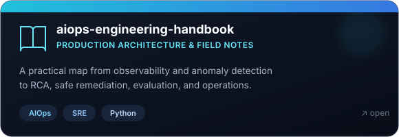
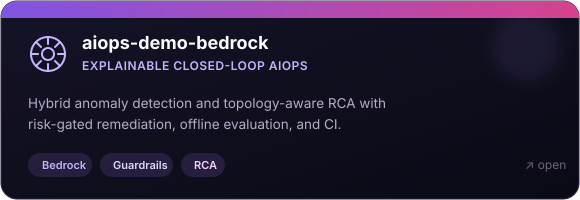
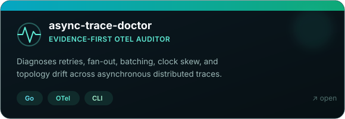
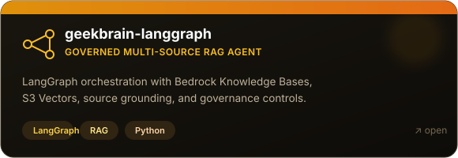

  

  <h1>Cái Xuân Hòa</h1>

  
<strong>AI Engineer · AIOps · LLM Systems · Cloud Reliability</strong>

  
<em>I turn noisy signals into explainable decisions and safe, observable automation.</em>

  

    <code>OBSERVE</code>&nbsp; → &nbsp;<code>REASON</code>&nbsp; → &nbsp;<code>ACT</code>&nbsp; → &nbsp;<code>EVALUATE</code>
  

  
  
  

 

## Building intelligence that can operate

<table>
  <tr>
    <td width="60%" valign="top">
      <h3>From models to dependable systems</h3>
      

        I build evidence-driven AI systems where <strong>machine learning</strong>,
        <strong>observability</strong>, and <strong>cloud operations</strong> meet.
        My current work explores explainable anomaly detection, topology-aware root-cause
        analysis, governed RAG, and risk-gated remediation on AWS.
      

      

        Previously, I joined <strong>XBrain</strong> as an AI Engineer Intern through the
        <strong>AWS Accelerator Internship Program</strong>, gaining hands-on experience
        with applied AI and cloud technologies.
      

    </td>
    <td width="40%" valign="top">
      <h3>Current signal</h3>
      
🔭 <strong>Building</strong> AIOps and agentic reliability tooling

      
🧠 <strong>Exploring</strong> LLMOps, evaluation, and safe automation

      
🌱 <strong>Learning in public</strong> One tested system at a time

    </td>
  </tr>
</table>

## Selected systems

  
  
  
  

  
<strong>More engineering tools</strong>

   
  <table>
    <tr>
      <td><a href="https://github.com/XUanhoa04/readme-fit"><strong>readme-fit</strong></a></td>
      <td>Repository-aware README quality auditor grounded in evidence.</td>
    </tr>
    <tr>
      <td><a href="https://github.com/XUanhoa04/repo-prune"><strong>repo-prune</strong></a></td>
      <td>Evidence-first repository cleanup with branch-aware findings.</td>
    </tr>
    <tr>
      <td><a href="https://github.com/XUanhoa04/safeops-vision"><strong>safeops-vision</strong></a></td>
      <td>Evidence-backed PPE incidents and safety workflows from cameras.</td>
    </tr>
  </table>

## Engineering lens

<table>
  <tr>
    <td width="33%" valign="top">
      <h3>◉ Observe</h3>
      
Metrics, logs, traces, topology, and data quality as first-class signals.

    </td>
    <td width="33%" valign="top">
      <h3>◇ Reason</h3>
      
Hybrid ML, retrieval, and LLM-assisted diagnosis with explicit evidence.

    </td>
    <td width="34%" valign="top">
      <h3>△ Act safely</h3>
      
Confidence thresholds, risk gates, human approval, rollback, and evaluation.

    </td>
  </tr>
</table>

## Toolbox

  
    
  
  
  
  

## GitHub telemetry

  
  
  

    

  <picture>
    <source media="(prefers-color-scheme: dark)" srcset="https://raw.githubusercontent.com/XUanhoa04/XUanhoa04/output/github-contribution-grid-snake-dark.svg" />
    <source media="(prefers-color-scheme: light)" srcset="https://raw.githubusercontent.com/XUanhoa04/XUanhoa04/output/github-contribution-grid-snake.svg" />
    
  </picture>

 

  
<em>Reliable AI starts with observable systems.</em>

  

