  <!-- ==================== HEADER BANNER ==================== -->
  

   

  <!-- ==================== HUD QUICK BADGES ==================== -->
  
  
  
  

## About me

Hi, I'm **Cái Xuân Hòa**, an Intern **AI Engineer** from Vietnam.

I previously interned at **XBrain** through the **AWS Accelerator Internship Program**, where I gained hands-on experience with AI and cloud technologies. I am currently learning more about **AIOps, Cloud, and LLMOps**, with an interest in building useful, reliable systems one step at a time.

## Tech stack

<table>
  <tr>
    <td width="30%"><b>AI & Data</b></td>
    <td>
      
      
      
      
      
      
    </td>
  </tr>
  <tr>
    <td><b>Cloud & Platform</b></td>
    <td>
      
      
      
      
      
    </td>
  </tr>
  <tr>
    <td><b>Observability</b></td>
    <td>
      
      
      
    </td>
  </tr>
  <tr>
    <td><b>Languages</b></td>
    <td>
      
      
      
    </td>
  </tr>
</table>

## Featured projects

<table>
  <thead>
    <tr>
      <th width="35%">Project</th>
      <th width="45%">Description</th>
      <th width="20%">Key Tech</th>
    </tr>
  </thead>
  <tbody>
    <tr>
      <td>
        <a href="https://github.com/XUanhoa04/synapse-ce">
          <b>⚡ Synapse CE</b>
        </a>
      </td>
      <td>Governed control plane for software composition analysis, recon, evidence, and reporting. <i>Verify Everything. Trust Nothing.</i></td>
      <td><code>Next.js</code> <code>TypeScript</code> <code>Cloud Control</code></td>
    </tr>
    <tr>
      <td>
        <a href="https://github.com/XUanhoa04/geekbrain-langgraph">
          <b>🧠 GeekBrain LangGraph</b>
        </a>
      </td>
      <td>Governed multi-source RAG agent built with LangGraph, Amazon Bedrock Knowledge Bases, and S3 vector stores.</td>
      <td><code>LangGraph</code> <code>Bedrock</code> <code>Agentic AI</code></td>
    </tr>
    <tr>
      <td>
        <a href="https://github.com/XUanhoa04/async-trace-doctor">
          <b>🩺 Async Trace Doctor</b>
        </a>
      </td>
      <td>Evidence-first OpenTelemetry auditor for async traces, retries, fan-out, batching, clock skew, and topology drift.</td>
      <td><code>OpenTelemetry</code> <code>AIOps</code> <code>Diagnostics</code></td>
    </tr>
    <tr>
      <td>
        <a href="https://github.com/XUanhoa04/aiops-demo-bedrock">
          <b>⚙️ AIOps Bedrock Loop</b>
        </a>
      </td>
      <td>Explainable AIOps closed loop: hybrid anomaly detection, multi-signal confidence, and topology-aware RCA via Bedrock.</td>
      <td><code>Amazon Bedrock</code> <code>AIOps</code> <code>RCA</code></td>
    </tr>
    <tr>
      <td>
        <a href="https://github.com/XUanhoa04/safeops-vision">
          <b>🛡️ SafeOps Vision</b>
        </a>
      </td>
      <td>Evidence-backed PPE incident recognition and safety workflows streaming from construction cameras.</td>
      <td><code>Computer Vision</code> <code>PyTorch</code> <code>FastAPI</code></td>
    </tr>
    <tr>
      <td>
        <a href="https://github.com/XUanhoa04/readme-fit">
          <b>🔍 README-Fit</b>
        </a>
      </td>
      <td>Repository-aware README quality auditor grounded in evidence to ensure accurate documentation.</td>
      <td><code>Python</code> <code>CLI</code> <code>Auditing</code></td>
    </tr>
  </tbody>
</table>

## GitHub activity

  
  

   

  

   

  <picture>
    <source media="(prefers-color-scheme: dark)" srcset="https://raw.githubusercontent.com/XUanhoa04/XUanhoa04/output/github-contribution-grid-snake-dark.svg" />
    <source media="(prefers-color-scheme: light)" srcset="https://raw.githubusercontent.com/XUanhoa04/XUanhoa04/output/github-contribution-grid-snake.svg" />
    
  </picture>

  Thanks for stopping by.

