  <!-- ==================== HERO BANNER ==================== -->
  

    

  <!-- ==================== QUICK HUD ACCESS BADGES ==================== -->
  
  
  
  

    

  <!-- ==================== CYBER TERMINAL DIAGNOSTICS ==================== -->
  

 

## 🌌 The Antigravity Manifesto & Frontend Philosophy

> *"Code is not just logic — it is kinetic digital architecture. In the realm of Antigravity, we eliminate sluggishness, dissolve latency, and craft buttery-smooth interfaces that feel alive at 120 FPS."*

<table>
  <tr>
    <td width="50%" valign="top">
      <h3>⚡ 120 FPS Fluidity & Micro-Interactions</h3>
      
Obsessed with sub-millisecond responsiveness, zero-jank frame rates, physics-based springs, and immersive kinetic motion that elevates plain websites into memorable interactive digital art.

    </td>
    <td width="50%" valign="top">
      <h3>🎨 Pixel-Perfect Glassmorphism</h3>
      
Designing modern, high-contrast dark mode interfaces, harmonious neon accents, robust token-based Design Systems, and accessible, responsive components that scale flawlessly.

    </td>
  </tr>
  <tr>
    <td width="50%" valign="top">
      <h3>🌐 3D WebGL & Spatial Canvas</h3>
      
Blending Three.js, WebGL shaders, particle simulations, and dynamic SVG vectors to create gravity-defying spatial web environments and interactive dashboards.

    </td>
    <td width="50%" valign="top">
      <h3>🧠 AI Agentic Interfaces</h3>
      
Unifying next-gen frontend engineering with autonomous AI workflows: real-time streaming LLM renderers, LangGraph agents, Amazon Bedrock integrations, and telemetry-aware HUDs.

    </td>
  </tr>
</table>

 

## 🧰 Mastery Arsenal & Tech Ecosystem

### 👑 Frontend Dominion (Core Mastery)

  

  
  
  
  
  
  
  

### 🤖 AI, Agentic Systems & Data Architecture

  

  
  
  
  
  
  

### ⚡ Cloud Platforms, Observability & Tooling

  

  
  
  
  
  
  

 

## 🚀 Flagship Systems & Star Repositories

<table>
  <thead>
    <tr>
      <th width="35%">Project</th>
      <th width="45%">Description</th>
      <th width="20%">Focus Tech</th>
    </tr>
  </thead>
  <tbody>
    <tr>
      <td>
        <a href="https://github.com/XUanhoa04/synapse-ce">
          <b>⚡ Synapse CE</b>
        </a>
      </td>
      <td>A governed control plane for software composition analysis, recon, evidence gathering, and automated reporting. <i>Verify Everything. Trust Nothing.</i></td>
      <td><code>Next.js</code> <code>TypeScript</code> <code>Cloud Control</code></td>
    </tr>
    <tr>
      <td>
        <a href="https://github.com/XUanhoa04/readme-fit">
          <b>🔍 README-Fit</b>
        </a>
      </td>
      <td>Repository-aware README quality auditor grounded in hard evidence. Ensures project documentation matches actual built architecture.</td>
      <td><code>Python</code> <code>CLI</code> <code>Auditing</code></td>
    </tr>
    <tr>
      <td>
        <a href="https://github.com/XUanhoa04/async-trace-doctor">
          <b>🩺 Async Trace Doctor</b>
        </a>
      </td>
      <td>Evidence-first OpenTelemetry auditor for asynchronous traces, retries, fan-out, batching, clock skew, and topology drift detection.</td>
      <td><code>OpenTelemetry</code> <code>AIOps</code> <code>Diagnostics</code></td>
    </tr>
    <tr>
      <td>
        <a href="https://github.com/XUanhoa04/geekbrain-langgraph">
          <b>🧠 GeekBrain LangGraph</b>
        </a>
      </td>
      <td>Governed multi-source RAG agent built with LangGraph, Amazon Bedrock Knowledge Bases, and S3 vector stores.</td>
      <td><code>LangGraph</code> <code>Bedrock</code> <code>Agentic AI</code></td>
    </tr>
    <tr>
      <td>
        <a href="https://github.com/XUanhoa04/safeops-vision">
          <b>🛡️ SafeOps Vision</b>
        </a>
      </td>
      <td>Evidence-backed PPE incident recognition and safety workflows streaming live from construction cameras.</td>
      <td><code>Computer Vision</code> <code>PyTorch</code> <code>FastAPI</code></td>
    </tr>
    <tr>
      <td>
        <a href="https://github.com/XUanhoa04/aiops-demo-bedrock">
          <b>⚙️ AIOps Bedrock Loop</b>
        </a>
      </td>
      <td>Explainable AIOps closed loop: hybrid anomaly detection, multi-signal confidence scoring, and topology-aware RCA via Bedrock.</td>
      <td><code>Amazon Bedrock</code> <code>AIOps</code> <code>Closed Loop</code></td>
    </tr>
  </tbody>
</table>

 

## 📊 Telemetry & GitHub Activity Matrix

  <table border="0">
    <tr>
      <td width="50%" align="center">
        
      </td>
      <td width="50%" align="center">
        
      </td>
    </tr>
  </table>

   

  

    

  <!-- Contribution Snake Animation -->
  <picture>
    <source media="(prefers-color-scheme: dark)" srcset="https://raw.githubusercontent.com/XUanhoa04/XUanhoa04/output/github-contribution-grid-snake-dark.svg" />
    <source media="(prefers-color-scheme: light)" srcset="https://raw.githubusercontent.com/XUanhoa04/XUanhoa04/output/github-contribution-grid-snake.svg" />
    
  </picture>

 

## 📡 Connect to the Antigravity Orbit

  
Whether you're building a groundbreaking frontend, orchestrating autonomous AI workflows, or crafting next-gen digital experiences — let's connect and build something extraordinary together.

  
  &nbsp;
  
  &nbsp;
  

    

  <!-- ==================== FOOTER ==================== -->
  

